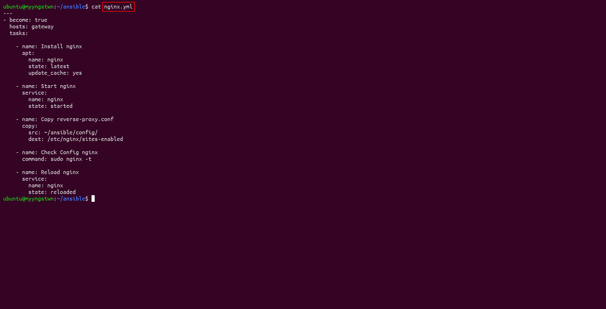

# Provisioning

## Terraform
### Setup Terraform

- Buat folder baru dan file baru `main.tf` untuk mengatur konfigurasi Terraform IDCH.

- Kemudian isi `main.tf` buat 4 VM dengan spesifikasi sebagai berikut :

|      VM      |  CPU  |  RAM  | Storage |
|    :---:     | :---: | :---: |  :---:  |
|     App      |   2   | 2 GB  |  20 GB  |
|    CI/CD     |   2   | 2 GB  |  20 GB  |
|   Gateway    |   1   | 1 GB  |  20 GB  |
|  Monitoring  |   2   | 2 GB  |  20 GB  |

```
terraform {
  required_providers {
    idcloudhost = {
      source = "bapung/idcloudhost"
      version = "0.1.3"
    }
  }
}

provider "idcloudhost" {
    auth_token = ""
    region = ""
}

resource "idcloudhost_vm" "yyg-appserver" {
    name = "yyg-appserver"
    os_name = "ubuntu"
    os_version= "20.04"
    disks = 20
    vcpu = 2
    memory = 2048
    username = "yyg"
    initial_password = "" 
    billing_account_id = 
    public_key = "" 
    backup = false
}

resource "idcloudhost_floating_ip" "ip-yyg-appserver" {
    name = "yyg-appserver"
    billing_account_id = 
    assigned_to = idcloudhost_vm.yyg-appserver.id
}


resource "idcloudhost_vm" "yyg-cicd" {
    name = "yyg-cicd"
    os_name = "ubuntu"
    os_version= "20.04"
    disks = 20
    vcpu = 2
    memory = 2048
    username = "yyg"
    initial_password = "" 
    billing_account_id =  
    public_key = "" 
    backup = false
}

resource "idcloudhost_floating_ip" "ip-yyg-cicd" {
    name = "yyg-cicd"
    billing_account_id =  
    assigned_to = idcloudhost_vm.yyg-cicd.id
}

resource "idcloudhost_vm" "yyg-gateway" {
    name = "yyg-gateway"
    os_name = "ubuntu"
    os_version= "20.04"
    disks = 20
    vcpu = 1
    memory = 1024
    username = "yyg"
    initial_password = "" 
    billing_account_id =
    public_key = "" 
    backup = false
}

resource "idcloudhost_floating_ip" "ip-yyg-gateway" {
    name = "yyg-gateway"
    billing_account_id =  
    assigned_to = idcloudhost_vm.yyg-gateway.id
}

resource "idcloudhost_vm" "yyg-monitoring" {
    name = "yyg-monitoring"
    os_name = "ubuntu"
    os_version= "20.04"
    disks = 20
    vcpu = 2
    memory = 2048
    username = "yyg"
    initial_password = "" 
    billing_account_id =  
    public_key = "" 
    backup = false
}

resource "idcloudhost_floating_ip" "ip-yyg-monitoring" {
    name = "yyg-monitoring"
    billing_account_id =  
    assigned_to = idcloudhost_vm.yyg-monitoring.id
}

```

- Kemudian lakukan perintah `terraform init` menginisialisasi direktori kerja yang berisi file konfigurasi Terraform.

 

- Kemudian lakukan perintah `terraform plan` membuat rencana eksekusi, yang memungkinkan melihat pratinjau perubahan yang akan dilakukan Terraform pada infrastruktur.


- Kemudian lakukan perintah `terraform apply` mengeksekusi tindakan yang diusulkan dalam rencana Terraform.


- Dan memeriksa VM telah berhasil dibuat menggunakan Terraform.


## Ansible
### Setup Ansible

- Pertama untuk menyiapkan **Ansible** adalah membuat `Inventory` (yang berisi dengan IP/Host dari server yang akan di koneksikan dengan Ansible) dan `ansible.cfg` (yang berisi konfigurasi dasar Ansible).


- Kemudian membuat file `ansible playbook` berdasarkan kebutuhan untuk instalasi di dalam VM.

### Install Docker & Node Exporter

- Untuk menginstall `Docker` dan `Node Exporter` on top docker di semua server. buat file `ansible playbook` terlebih dahulu. Kemudian jalankan menggunakan perintah dibawah ini.

```
ansible-playbook (nama-file).yml
```


- `Docker` dan `Node Exporter` sudah terinstall di masing-masing VM.


### Install NGINX & Reverse Proxy

- Sebelum menginstall `nginx` buat file konfigurasi `Reverse Proxy`.


- Kemudian buat file `nginx` untuk server gateway dan jalankan.




- `nginx` sudah terinstall di server gateway.


### Install Jenkins

- Kemudian buat file `jenkins` on top docker untuk server cicd dan jalankan.


- `Jenkins` sudah terinstall di server cicd.


### Install Prometheus & Grafana

- Kemudian buat file `Prometheus & Grafana` on top docker untuk server monitoring dan jalankan.


- `Prometheus & Grafana` sudah terinstall di server monitoring.


