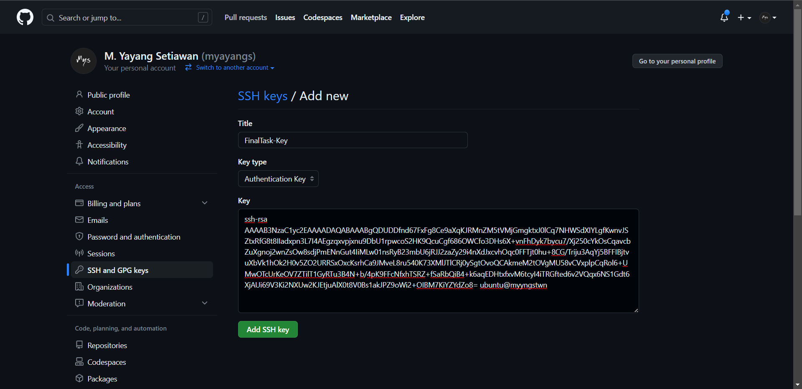
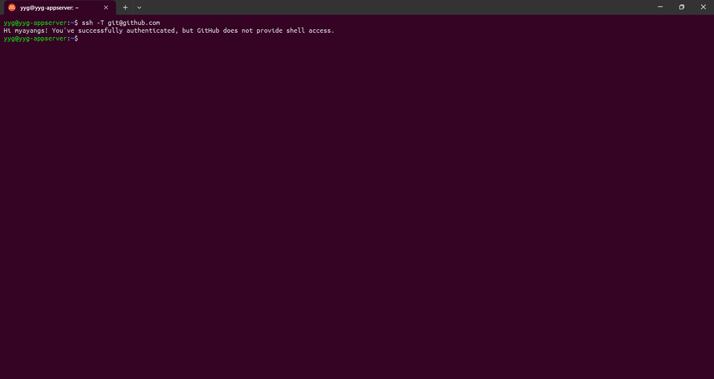
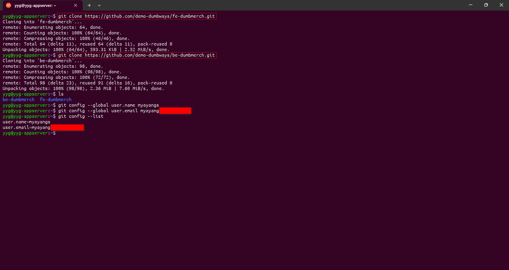
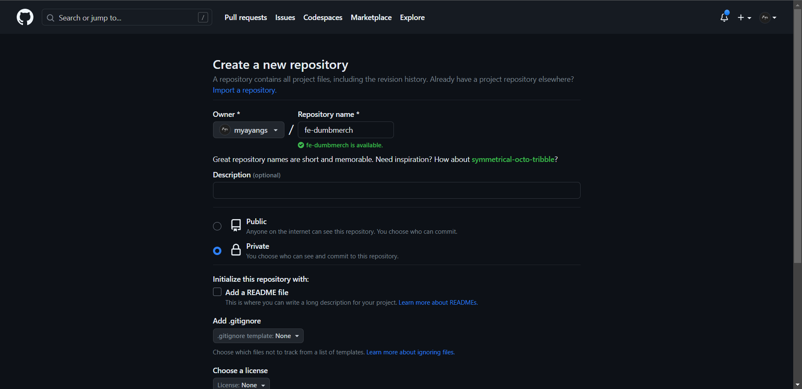
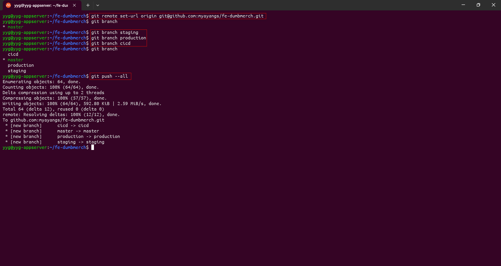
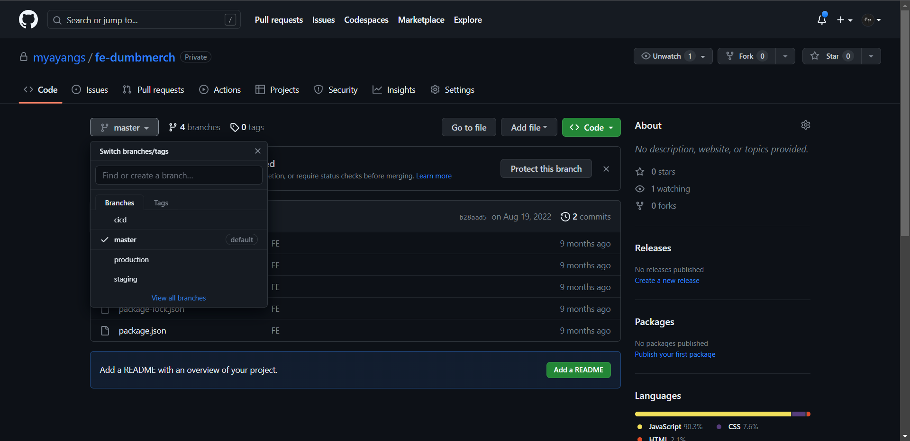
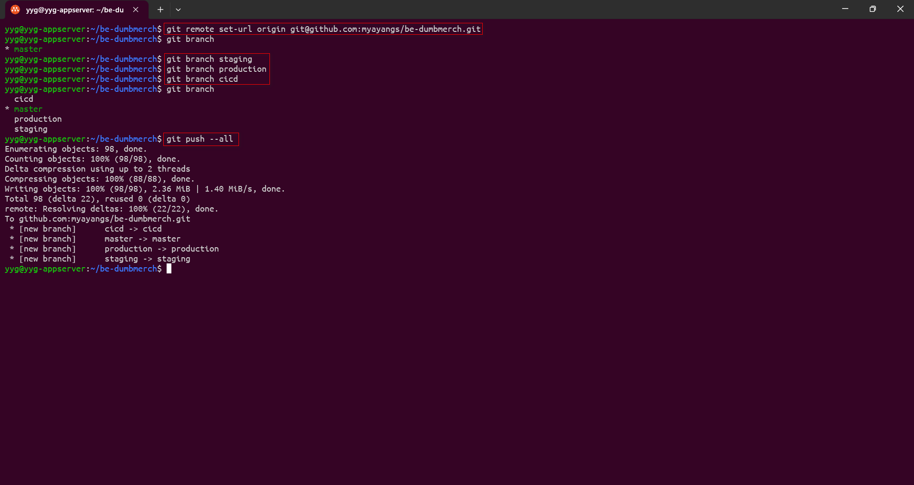
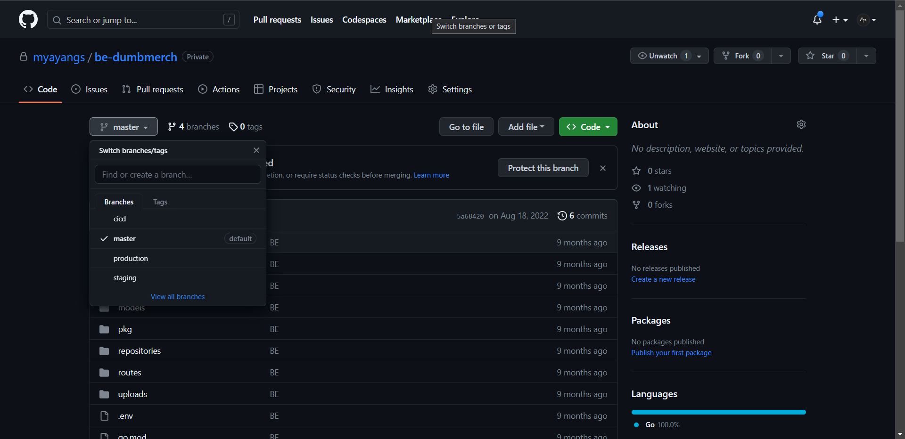

# Repository

- Pertama,  copy SSH Key `.ssh/id_rsa.pub` pada server dan masukkan kedalam config github dengan membuka https://github.com/settings/keys. Lalu test SSH  connection untuk memastikan bahwa sudah terhubung.

```
ssh -T git@github.com
```




- Kemudian clone repositori [fe-dumbmerch](https://github.com/demo-dumbways/fe-dumbmerch) & [be-dumbmerch](https://github.com/demo-dumbways/be-dumbmerch). Lalu mengatur ***username*** dan ***email*** di Git untuk pull dan push.

```
git clone https://github.com/demo-dumbways/fe-dumbmerch
```

```
git clone https://github.com/demo-dumbways/be-dumbmerch
```



## Create Private Repository & Branch Repository

### Frontend
- Pertama buat terlebih dahulu private repositori frontend



- Kemudian masuk ke direktori `fe-dumbmerch` dan mengganti `remote url` menjadi repositori yang dibuat sebelumnya. Setelah itu buat 3 branch baru yaitu **staging**, **production** dan **cicd**. Dan push ke semua branch.



- setelah itu cek pada repositori jika branch sudah di tambahkan.



### Backend

- Pertama buat terlebih dahulu private repositori backend


- Kemudian masuk ke direktori `be-dumbmerch` dan mengganti `remote url` menjadi repositori yang dibuat sebelumnya. Setelah itu buat 3 branch baru yaitu **staging**, **production** dan **cicd***. Dan push ke semua branch.



- setelah itu cek pada repositori jika branch sudah di tambahkan.



