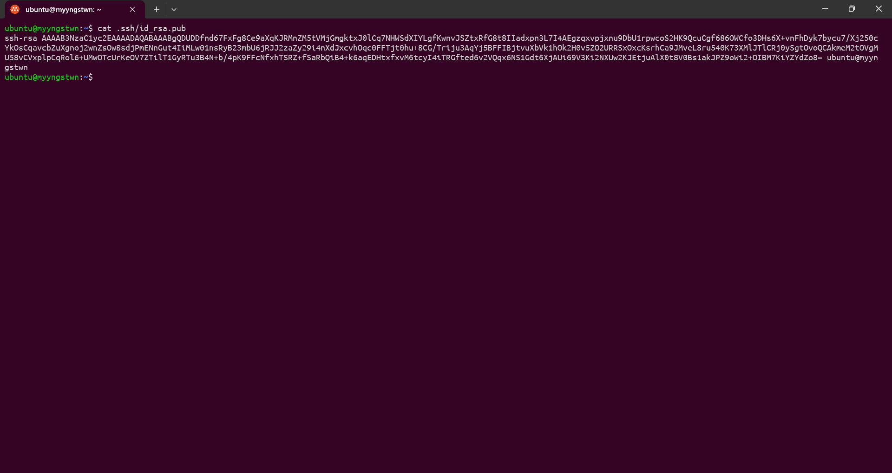
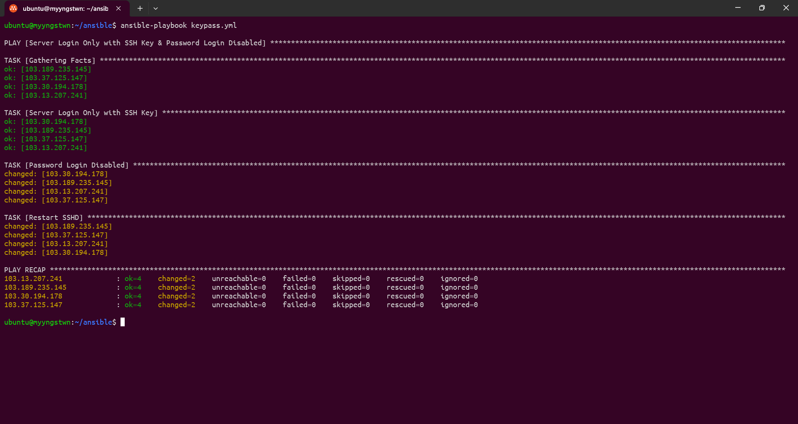
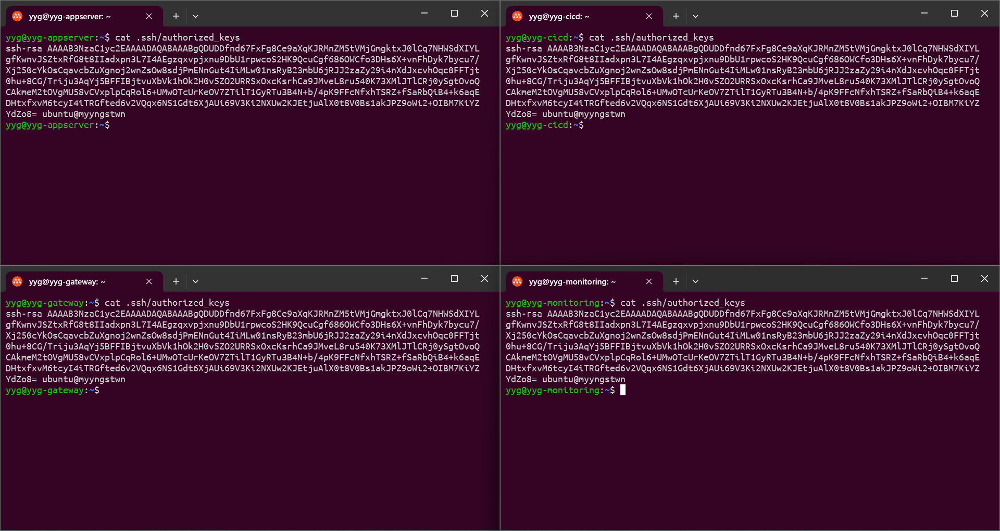
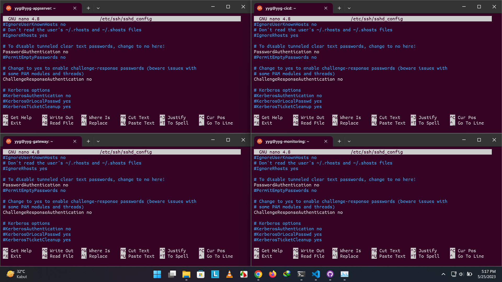
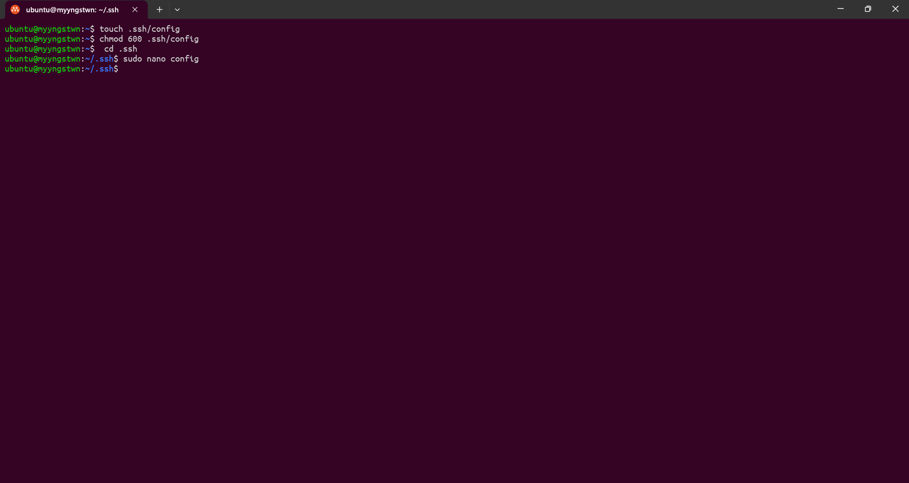
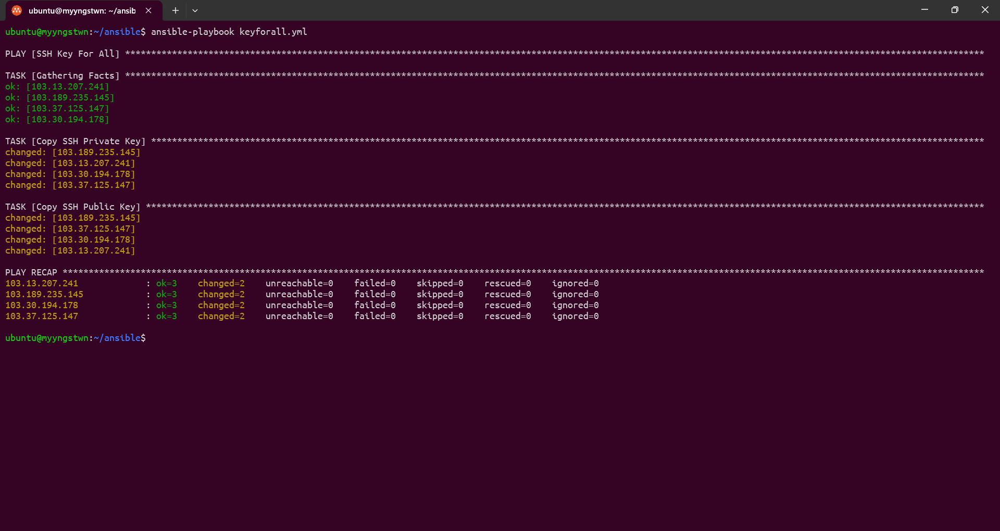
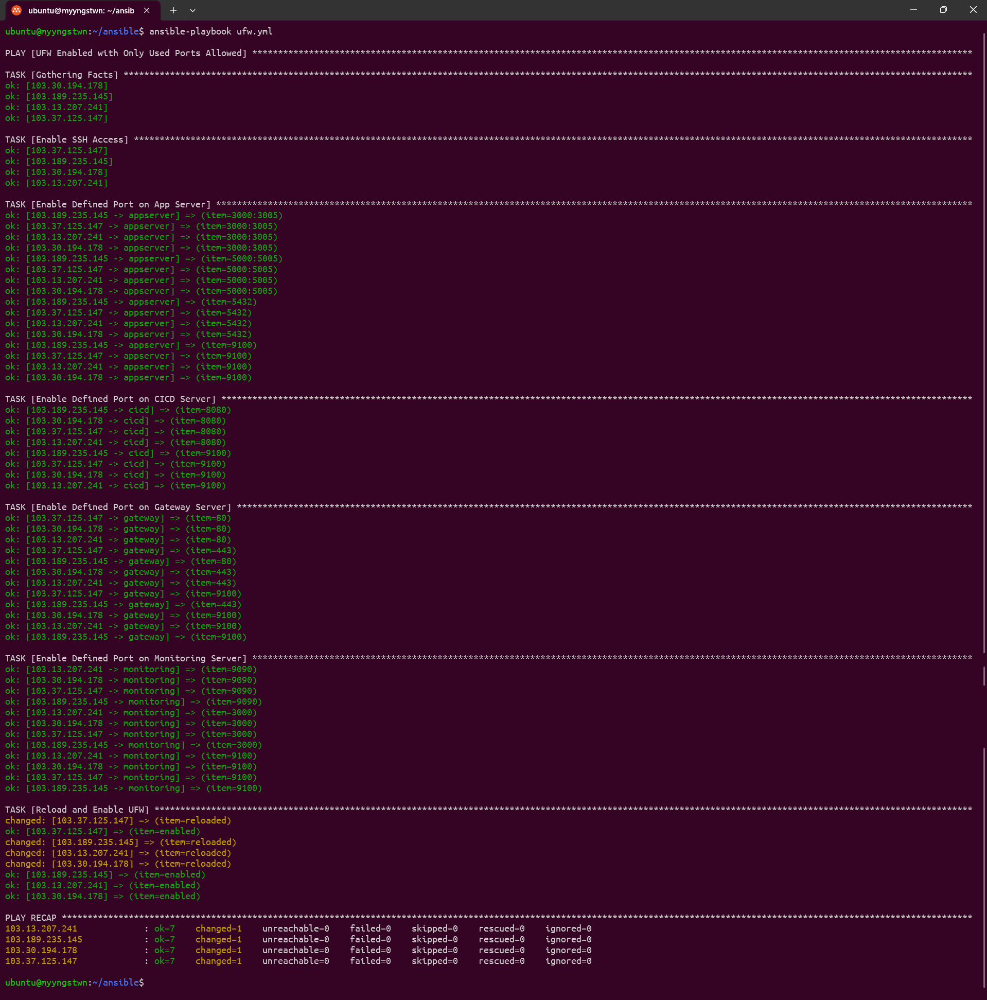
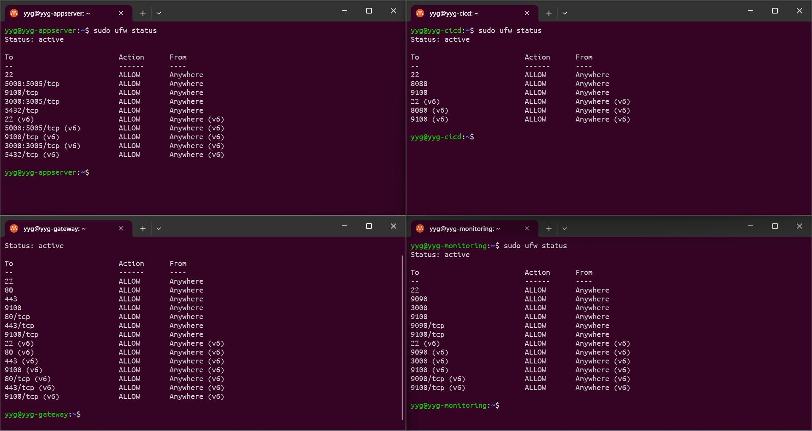

# Server Management

- Pertama buat SSH Key pada local server. SSH Key yang akan di gunakan untuk mengakses server tanpa password.

## Server Login with SSH Key & Password Login Disable

- Pada saat pembuatan VM di Terraform sudah memasukan SSH Public Key. Dengan cara menyalin SSH Public Key local server ke dalam file `main.tf`. Apabila lupa atau belum memasukan SSH Public Key ke dalam server maka bisa menggunakan `ansible-playbook` tanpa harus login ke dalam server tersebut dan kemudian menonaktifkan login kata sandi pada setiap server juga menggunakan `ansible-playbook`. 

## Create SSH Config & Use 1 SSH Key 

- Kemudian membuat konfigurasi SSH untuk lokal dan juga untuk gateway VM dimana dapat masuk menggunakan IP pribadi pada gateway VM.

- Kemudian menggunakan satu kunci SSH dari lokal server ke semua VM untuk login, CICD, dan juga untuk repositori ke Github. 

## UFW Enabled with only Port used Allowed

- Kemudian membuat `ansible-playbook` untuk menambahkan firewall pada setiap server dan memasukkan port yang diperlukan.

