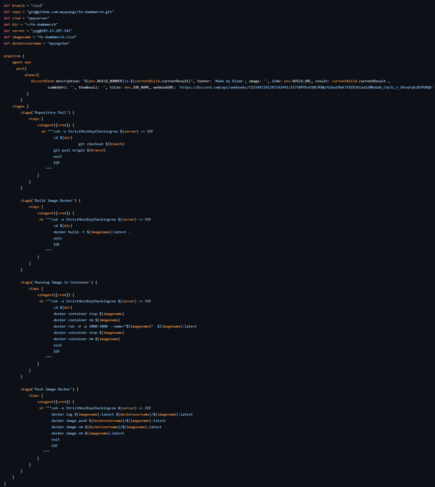
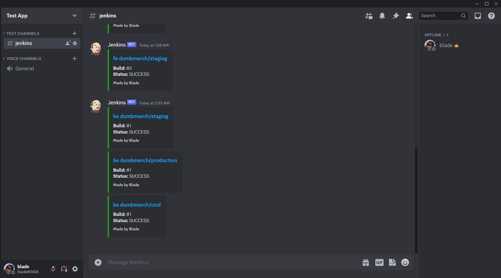

# Deployment

## Application
## Docker image frontend & backend Staging

### Frontend
- Pertama, ke folder frontend lalu pindah ke branch staging. 

- Kemudian salin ***.gitignore*** ke ***.dockerignore***.

- Kemudian membuat ***.env*** (environment) yaitu untuk menghubungkan frontend dan backend.

```
REACT_APP_BASEURL=http://api.yyg.studentdumbways.my.id/api/v1

```

- Kemudian membuat ***Dockerfile*** untuk membuat docker image.

```
FROM node:16-alpine as staging
WORKDIR /app
COPY . .
RUN npm install
EXPOSE 3000
CMD [ "npm", "start"]
```

- Kemudian build image dengan perintah dibawah ini.

```
docker build -t myyngstwn/be-dumbmerch-staging:latest .
```


### Backend

- Pertama, ke folder backend lalu pindah ke branch staging.  

- Kemudian membuat ***.env*** (environment) yaitu untuk menghubungkan frontend dan backend.

```
 DB_HOST= (ip appserver)
 DB_USER=yyg
 DB_PASSWORD=Katasand1
 DB_NAME=dumbmerch
 DB_PORT=5432 
 PORT=5000

```

- Kemudian membuat ***Dockerfile*** untuk membuat docker image.

```
FROM golang:1.20-alpine
WORKDIR /app   
COPY . . 
RUN go get ./ && go build && go mod download
EXPOSE 5000
CMD ["go", "run", "main.go"]
```

- Kemudian build image dengan perintah dibawah ini.

```
docker build -t myyngstwn/be-dumbmerch-staging:latest .
```


### Deploy Staging

- Pertama, membuat file ***compose.yml*** untuk docker compose.

```
version: "3.8"
services:
   db:
    image: postgres:latest
    container_name: db-dumbmerch
    ports:
      - 5432:5432
    volumes:
      - ~/postgresql:/var/lib/postgresql/data
    environment:
      - POSTGRES_USER=yyg
      - POSTGRES_PASSWORD=Katasand1
      - POSTGRES_DB=dumbmerch
   backend:
    depends_on:
      - db
    image: myyngstwn/be-dumbmerch-staging:latest
    container_name: be-dumbmerch
    stdin_open: true
    restart: unless-stopped
    ports:
      - 5000:5000
   frontend:
    image: myyngstwn/be-dumbmerch-staging:latest
    container_name: fe-dumbmerch
    stdin_open: true
    restart: unless-stopped
    ports:
      - 3000:3000
```

- Kemudian jalankan dengan perintah dibawah ini.

```
docker compose up -d
``` 


## Docker image frontend & backend Production

### Frontend
- Pertama, ke folder frontend lalu pindah ke branch production. 

- Kemudian salin ***.gitignore*** ke ***.dockerignore***.

- Kemudian membuat ***.env*** (environment) yaitu untuk menghubungkan frontend dan backend.

```
REACT_APP_BASEURL=http://api.yyg.studentdumbways.my.id/api/v1
```

- Kemudian membuat ***Dockerfile*** untuk membuat docker image.

```
FROM node:16-alpine as staging
WORKDIR /app
COPY . .
RUN npm install

FROM node:16-alpine as production
WORKDIR /app
COPY --from=staging /app /app
EXPOSE 3000
CMD [ "npm", "start"]
```

- Kemudian build image dengan perintah dibawah ini.

```
docker build -t myyngstwn/be-dumbmerch-production:latest .
```


### Backend

- Pertama, ke folder backend lalu pindah ke branch production.  

- Kemudian membuat ***.env*** (environment) yaitu untuk menghubungkan frontend dan backend.

```
 DB_HOST= (ip appserver)
 DB_USER=yyg
 DB_PASSWORD=Katasand1
 DB_NAME=dumbmerch
 DB_PORT=5432 
 PORT=5000

```

- Kemudian membuat ***Dockerfile*** untuk membuat docker image.

```
FROM golang:1.20-alpine as staging
WORKDIR /app   
COPY . . 
RUN go get ./ && go build && go mod download

FROM golang:1.20-alpine as production
WORKDIR /app
COPY --from=staging /app /app
EXPOSE 5000
CMD ["go", "run", "main.go"]
```

- Kemudian build image dengan perintah dibawah ini.

```
docker build -t myyngstwn/be-dumbmerch-production:latest .
```


### Deploy Production

- Pertama, membuat file ***compose.yml*** untuk docker compose.

```
version: "3.8"
services:
   db:
    image: postgres:latest
    container_name: db-dumbmerch
    ports:
      - 5432:5432
    volumes:
      - ~/postgresql:/var/lib/postgresql/data
    environment:
      - POSTGRES_USER=yyg
      - POSTGRES_PASSWORD=Katasand1
      - POSTGRES_DB=dumbmerch
   backend:
    depends_on:
      - db
    image: myyngstwn/be-dumbmerch-production:latest
    container_name: be-dumbmerch
    stdin_open: true
    restart: unless-stopped
    ports:
      - 5000:5000
   frontend:
    image: myyngstwn/be-dumbmerch-production:latest
    container_name: fe-dumbmerch
    stdin_open: true
    restart: unless-stopped
    ports:
      - 3000:3000
```

- Kemudian jalankan dengan perintah dibawah ini.

```
docker compose up -d
``` 


- Kemudian docker login untuk mempush/menaruh images ke dalam docker hub.

## CI/CD : Jenkins

- Pertama masukkan password yang digenerate Jenkins secara otomatis untuk login sebagai admin.

- Kemudian **select plugin to install**. Dan menambah plugin, yaitu **ssh agent**.


- Kemudian bisa memasukkan `username` dan `password` baru.


- Kemudian membuat ***credentials*** dan menambahkan SSH Private key ke dalam Jenkins.


- Kemudian tambahkan plugin ***Multibranch Scan Webhook Trigger.*** Untuk mengaktifkan trigger pada saat ada update di repository akun github dan ***Discord Notifier*** untuk notifikasi. 


- Kemudian membuat **job** baru frontend. Pilih multibranch pipeline, dikarenakan kita ingin membuat dengan banyak branch.


- Kemudian pilih git untuk repositorynya dan pilih credentials.


- Kemudian mengaktifkan Multibranch Scan Webhook Trigger.


- Kemudian membuat file Jenkins pada masing-masing branch.

***Jenkinsfile staging***



***Jenkinsfile production***


- Kemudian mengaktifkan trigger pada repository akun github ditambahkan di bagian Webhooks.


- Kemudian jalankan **Scan Multibranch Pipeline**.


- Kemudian pada saat muncul centang dan berwarna hijau, maka trigger sudah berjalan dengan baik.


- Dan notifikasi discord berhasil muncul.


- Kemudian Untuk backend langkah-langkahnya sama seperti frontend.


