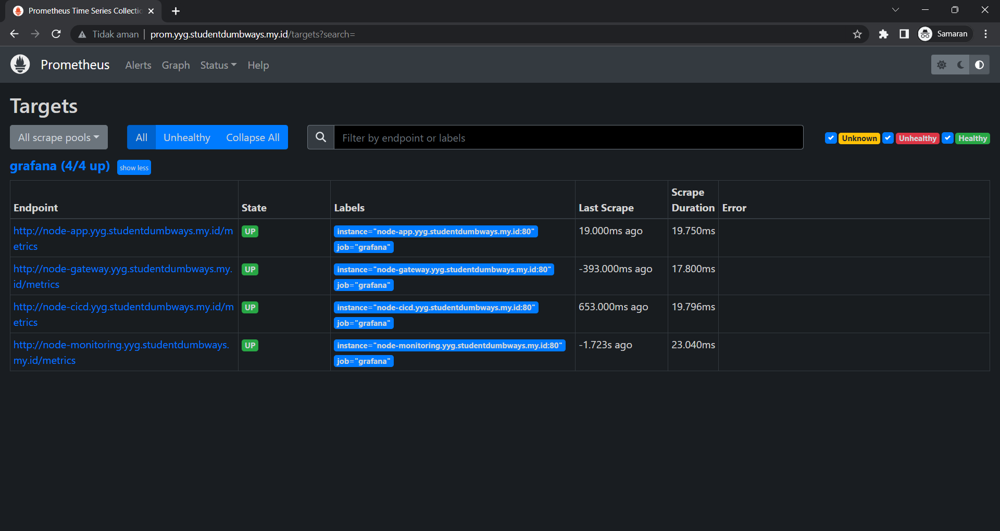

# Monitoring
## Monitor resources for Appserver, CI/CD & Gateway

- Ini adalah node-expoter dari ketiga server.

- Kemudian node-exporter dimonitoring oleh Prometheus.

- Kemudian setup ***data sources*** grafana yaitu prometheus yang berfungsi sebagai sumber datanya.

## Full Working dashboard in Grafana
### Template Dashboard

- kemudian membuat dashboard menggunakan template. Disini menggunakan template [Node Exporter Full](https://grafana.com/grafana/dashboards/1860-node-exporter-full/).

### Alerting Dashboard

- Pertama, memasukkan ***contact point*** untuk alerting. Disini menggunakan ***contact point*** alerting Discord.

- Kemudian membuat ***alert rules*** untuk CPU, RAM dan Disk.

- Discord notifikasi sudah berhasil.

