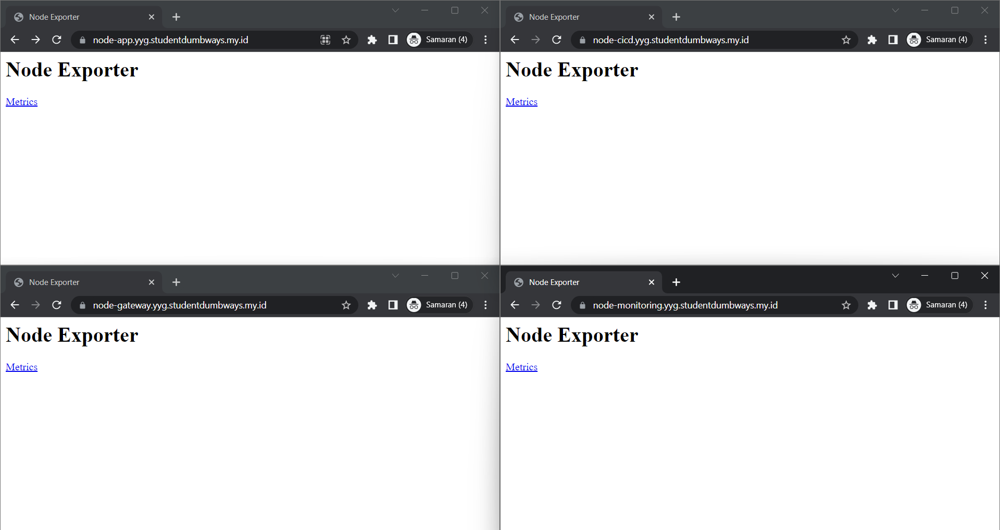

# Web Server

## Create Domain

- Pertama membuat semua domain menggunakan platform Cloudflare, dan semua IP akan diarahkan ke IP publik server Gateway.


## SSL Certbot using wildcard

- Kemudian install Certbot terlebih dahulu. Untuk menginstal Certbot, dapat mengikuti dokumentasi yang disediakan [cerbot](https://certbot.eff.org/instructions?ws=nginx&os=ubuntufocal&tab=wildcard).


- Kemudian membuat dan menginstal sertifikat dengan perintah dibawah ini.

```
sudo certbot certonly \
--manual \
--preferred-challenges=dns \
--email (your-email).com \
--server https://acme-v02.api.letsencrypt.org/directory \
--agree-tos \
-d *.yyg.studentdumbways.my.id
```


- Semua domain sekarang dilindungi dengan sertifikat SSL.





